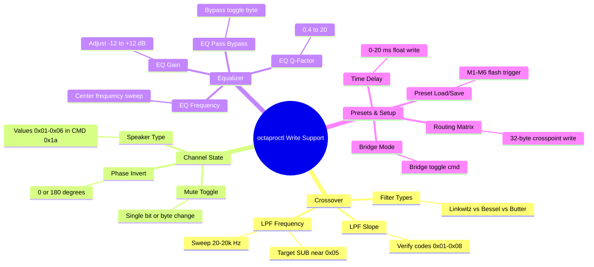

# Original Companion Application Functionality: Audiobeat OctaPro 8.2 / Sennuopu HIFI-X12

This document provides a comprehensive description of the user interface features and functional capabilities of the original companion software for the **Audiobeat OctaPro 8.2** (OEM: **Sennuopu HIFI-X12**). It is compiled from the official user manual ([docs/Sennuopu HIFI-X12 Manual EN V201120.pdf](file:///Users/ruslan_bielyi/Documents/demo/audiobeat-octapro-8-2-reverse/docs/Sennuopu%20HIFI-X12%20Manual%20EN%20V201120.pdf)) and static analysis of the Windows application ([Audiobeat OctaPro 8.2 V1.0.7_250801.exe](file:///Users/ruslan_bielyi/Documents/demo/audiobeat-octapro-8-2-reverse/FINDINGS_EXE.md)).

---

## 1. Companion Apps Overview

The hardware is designed to be tuned via three main interfaces:
1. **PC Software:** A desktop application built with Qt and MinGW. It connects via a USB-A to USB-B cable, communicating over USB HID interface 4.
2. **Wechat Applet:** A mobile applet that connects via Bluetooth (APTX-HD BLE). It mirrors the tuning features of the PC software.
3. **Physical Wire Controller:** A dash-mounted remote controller with a display and rotary knob that connects via a dedicated port for quick adjustments (volume, source, preset recall).

---

## 2. PC & Mobile App Functional Specifications

### A. Connection State & Handshake
- **Status Indicator:** Displays `Disconnect` (red) or `Connected` (green).
- **Handshake Sequence:** The host app must send a connection probe and session-open command before the device unlocks and responds with channel parameter blocks.

### B. Input Source Selection
The system supports six audio input sources with specific playback priorities:
1. **Bluetooth (APTX-HD BLE):** High priority. If active playback is detected, the device auto-switches to BT.
2. **USB Flash Drive (U-disk):** High priority. Auto-switches on insertion.
3. **Optical Fiber (TOSLINK / OPT):** Normal priority.
4. **High-Level Inputs:** (Speaker-wire inputs from factory head unit). Normal priority.
5. **Low-Level Inputs:** (RCA inputs). Normal priority.
6. **USB Audio:** (PC/Mac sound card). Normal priority.

> [!NOTE]
> High-level input mixing is preserved under other input modes to prevent losing factory warning alerts (such as reversing radar tones).

### C. Master Control Section
- **Master Volume:** Main fader adjusts output level from **+6 dB to -60 dB** (and `-inf` / mute).
- **Master Mute:** Global toggle to instantly silence all channels.
- **Option Dropdown:**
  - Language: Switch between English and Chinese.
  - Factory Reset: Restores the system parameters to factory defaults.
  - Noise Gate Threshold: Used to recalibrate the audio noise floor gate.
  - Version Queries: Displays software and firmware versions.

### D. Per-Channel Parameter Tuning (CH1 – CH10)
Each of the 10 output channels has an independent set of controls:

#### 1. Volume & Mute
- **Channel Gain:** Slider range from **0 dB to -60 dB**.
- **Channel Mute:** Individual toggle button to silence the channel.

#### 2. Phase Inversion
- **Phase Shift:** Instantly flips output polarity between **0° (normal phase)** and **180° (antiphase)**.

#### 3. Speaker Type Selection
Drop-down preset menu to designate the driver type. The system automatically restricts the default crossover ranges based on this selection:
- **HF:** High Frequency (Tweeter)
- **MF:** Mid Frequency
- **LF:** Low Frequency (Woofer)
- **MHF:** Medium-High Frequency
- **MLF:** Medium-Low Frequency
- **FF:** Full Frequency (default)

#### 4. Crossover Filters (HPF & LPF)
Independent filters per channel to control the frequency band:
- **Frequency Range:** 20 Hz to 20,000 Hz (adjusted via slider, text field, or mouse wheel).
- **Filter Algorithms:**
  - **Linkwitz-Riley**
  - **Bessel**
  - **Butterworth**
- **Crossover Slope:** Determines the attenuation rate:
  - Options: **6 / 12 / 18 / 24 / 30 / 36 / 42 / 48 dB/octave**.

#### 5. Parametric Equalizer (EQ)
- **Bands:** **31 parametric EQ bands** per channel.
- **Q-Factor (Width):** Range from **0.4 to 20** (default width is 4.3).
- **Gain:** Range from **-12 dB to +12 dB**.
- **Frequency:** Sweeps from 20 Hz to 20,000 Hz.
- **EQ Reset (RST):** Resets either the "Current" channel or "All" channels to a flat curve (0 dB, Q=4.3, center frequencies distributed by 1/3-octave).
- **EQ Bypass (Pass):** Toggles comparison mode (bypasses all EQ filters without clearing the programmed values).

#### 6. Time Delay (Time Alignment)
- **Function:** Delays individual speaker outputs to correct acoustic imaging.
- **Range:** 0 to 20 ms.
- **Display Units:** Toggles between **milliseconds (ms)**, **centimeters (cm)**, and **inches (in)**.
  - Conversions: 1 ms $\approx$ 34 cm $\approx$ 13.4 in.

### E. Channel Bridging & Linking
- **Bridge Mode:** Links CH7 and CH8 together into a single mono channel. The positive terminal of CH7 and negative of CH8 are connected. Crossover, gain, and EQ parameters for the bridged pair are controlled strictly through the CH7 interface.
- **Channel Link (Link L&R):** Allows grouping of arbitrary channels (typically L/R pairs like CH1/CH2, CH3/CH4) for simultaneous, synchronized tuning. Changes made to one linked channel are instantly cloned to the other.

### F. Input Routing Matrix
A 10×10 cross-point mixing grid that routes any combination of inputs to any output.
- **Level Controls:** Adjust mixing levels from **0% to 100%** (unity gain) per crosspoint.
- Allows summing (e.g., mixing Left + Right at 50% to feed a center channel output) or sub-mixing.

### G. Preset Management
- **Hardware Presets:** The device contains **6 internal preset slots** (M1 to M6). Users can click `Save` to write the active tuning state to the internal flash memory, or `Load` to recall a preset.
- **File Presets:** Allows exporting the entire tuning configuration to the computer as a binary `.dat` file (header `US002`, size 2387 bytes), or importing it to apply.

---

## 3. Physical Wire Controller Capabilities

The wire controller provides a hardware interface for quick dashboard adjustments:
1. **Volume Adjustment:** Adjusts master volume from steps 0 to 35.
2. **Playback Control (U-disk mode):**
   - Play / Pause (by pressing the volume knob).
   - Track Skip (forward / back buttons).
   - Menu navigation to select folder directory and file lists.
3. **Menu Option Configurations:**
   - Set Backlight intensity.
   - Set Input Source.
   - Load Preset (recalls M1 to M6 internal slots).
   - Set Circular Mode (repeat track, repeat folder, shuffle).
   - Set LED Colors.
   - Display DSP / Bluetooth / Software versions and system language.

---

## 4. Derived Roadmap for `octaproctl` Implementation

By linking the above GUI elements to physical DSP registers, the roadmap for `octaproctl` write support is defined below:

